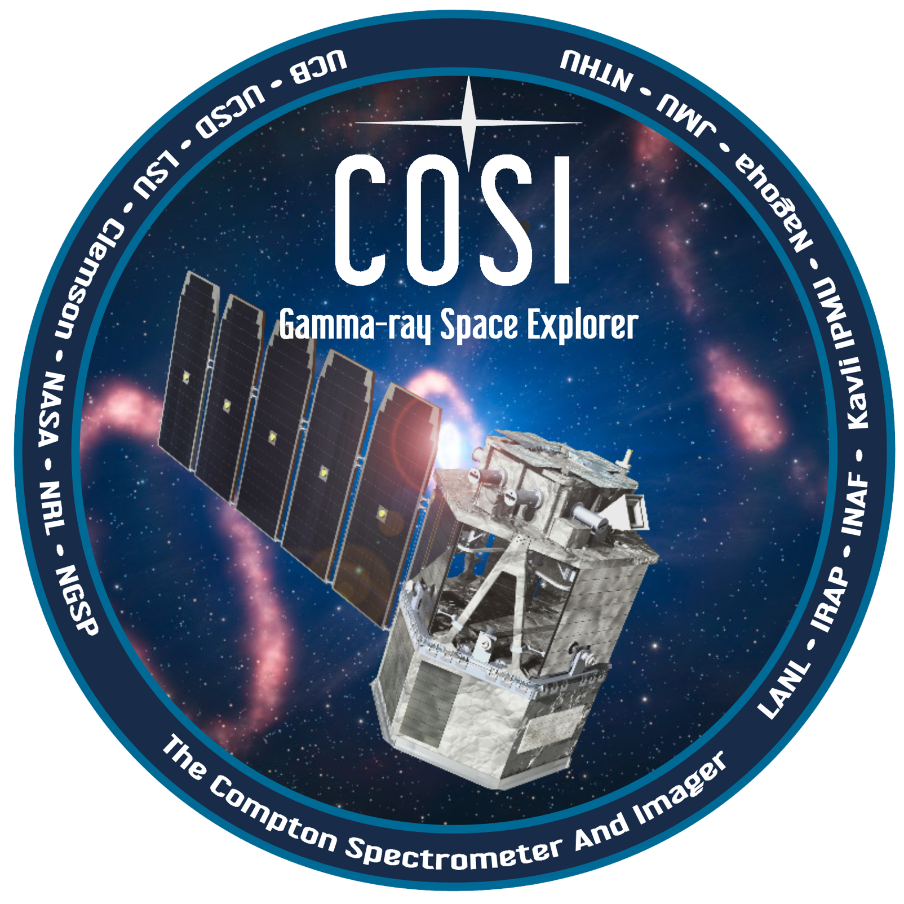

  
# Welcome to the COSI Data Challenges!

### latest release: [cosi-data-challenge-2](cosi-data-challenge-2)

## Table of Contents

- [Introduction](#introduction)
- [Getting Started](#getting-started)
- [System Requirements](#system-requirements)
- [Getting Help](#getting-help)
- [Releases](#releases)
- [Computing Resources](#computing-resources)
- [Simulation Tools](#simulation-tools)
- [Executive Summary of Current and Past Challenges](#executive-summary-of-current-and-past-challenges)
- [Useful Reference Guides](#useful-reference-guides)
- [Citing](#citing)

## Introduction
The COSI data challenges are released on a yearly basis in preparation for the launch of the COSI SMEX mission. They are based on simulated data, which is intended to closely mimic the real flight data. Every year the data challenges have increasingly more realistic source and background models, and they are analyzed with increasingly complete and matured analysis tools. In general there are two main goals of the data challenges:

1. Facilitate development of the COSI data pipeline and analysis tools.
   - With routine feedback from scientists. 
   - Alongside development of the expected source models by the science team. 
2. Provide resources to the astrophysics community to become familiar with COSI data.
   - Excellent training for science team in preparation for first analyses after launch.
   - Public releases help with community building before COSI data is released. 

## Getting Started

## System Requirements
One of our goals in developing cosipy is to make it easily accesible to all users. **All of the data challenges starting with DC2 should be doable on a laptop with at least 16 GB of RAM**. We are still working on optimizing the code, and so please let us know if you are running into memory issues. 

## Getting Help
Please submit a new issue in the [cosipy](https://github.com/cositools/cosipy) git repository if you have issues with cosipy. If you have general feedback, or need further assistance, please reach out to the COSI Data Challenge team lead, Chris Karwin ([christopher.m.karwin@nasa.gov](mailto:christopher.m.karwin@nasa.gov)), the cosipy implementation lead, Israel Martinez-Castellanos ([israel.martinezcastellanos@nasa.gov](israel.martinezcastellanos@nasa.gov)), and the pipeline development lead Carolyn Kierans ([carolyn.a.kierans@nasa.gov](carolyn.a.kierans@nasa.gov)).

## Releases

- Data challenge 1, March 2023: [cosi-data-challenge-1](cosi-data-challenge-1)
- Data challenge 2, March 2024: [cosi-data-challenge-2](cosi-data-challenge-2)
- Data challenge 3, March 2025: [cosi-data-challenge-3](cosi-data-challenge-3)
- Data challenge 4: Planned for March 2026
- Data challenge 5: Planned for March 2027 (final challenge before launch :rocket:!)

## Computing Resources

  
The simulations for the COSI data challenges are ran on high performance computing clusters. Most notably, we have made extensive use of NASA's [Discover cluster](https://www.nccs.nasa.gov/systems/discover), the [MOGON](https://mogonwiki.zdv.uni-mainz.de/docs/introduction/what_is_mogon) cluster in Mainz, and Clemson University's [Palmetto](https://docs.rcd.clemson.edu/palmetto/) cluster. 

## Simulation Tools

## Executive Summary of Current and Past Challenges 
- **[Data Challenge 1](cosi-data-challenge-1):**
  - Focus: 2016 COSI Balloon flight.
  - Release includes real flight data for the Crab.
  - Main goal: learn the fundamentals of analyzing Compton data with COSI.
  - The analysis tools used for DC1 are only preliminary (referred to as cosipy classic).
    - Developed by Thomas Siegert for analysis of the 2016 balloon data. 
  - Contains 3 straightforward examples of COSI’s science goals:
    - Extracting energy spectra from the Crab, Cen A, Cygnus X-1, and Vela
    - Imaging bright point sources, such as the Crab and Cygnus X-1.
    - Imaging diffuse emission from the positron-electron annihilation 511 keV and Al-26 1.8 MeV gamma-ray lines.
      DC2 is publicly available: https://github.com/cositools/cosi-data-challenge-2.
- **[Data Challenge 2](cosi-data-challenge-2):**
  - Focused on COSI SMEX mission.
  - First (alpha) release of cosipy. 
  - Data challenges for all the main science groups (none for dark matter and solar)
  - All models and challenges provided by respective COSI science teams.
  - Uses 3 months of observations, for an equatorial orbit at 550 km, with a zenith pointing. 
  - All BG components are included, except for SAA passage (i.e. trapped particles).
    - BG also includes time variability from changing geomagnetic cutoff.
  - We simulated 12 background components, and 30 unique sources, running 49 different source simulations in total (using multiple models for some of the sources).
  - Contains 7 main tutorials demonstrating all the tools/methods needed for completing the challenges, included as part of the cosipy release:
    - dataIO
    - GRB localization
    - GRB spectral fit
    - Crab spectral fit
    - 511 spectral fit
    - Crab imaging
    - 511 imaging
- **[Data Challenge 3](cosi-data-challenge-3):**
  - Focused on COSI SMEX mission.
  - First (alpha) release of cosipy. 
  - Data challenges for all the main science groups (including for dark matter and solar), covering all of COSI's primary science objectives. 
  - All models and challenges provided by respective COSI science teams.
  - Uses 3 months of observations, for an equatorial orbit at 530 km.
  - Simulations include rocking of instruement.
    - Pointing changes between +/- 22 degrees every 12 hrs, with 8 minute transition time. 
  - Using detailed COSI SMEX mass model.
  - Simulating all background components in low-Earth orbit, including variability from geomagnetic cutoff, long-term buildup, and full SAA passage.
    - Background includes the Galactic diffuse continuum for the first time. 
  - New methods in both MEGAlib and cosipy to account for Earth occultation with a non-zenith pointing. 
  - First time including polarization.
  - New methods to estimate the background for continuum sources, line sources, and transient sources. 
## Useful Reference Guides

## Citing 
